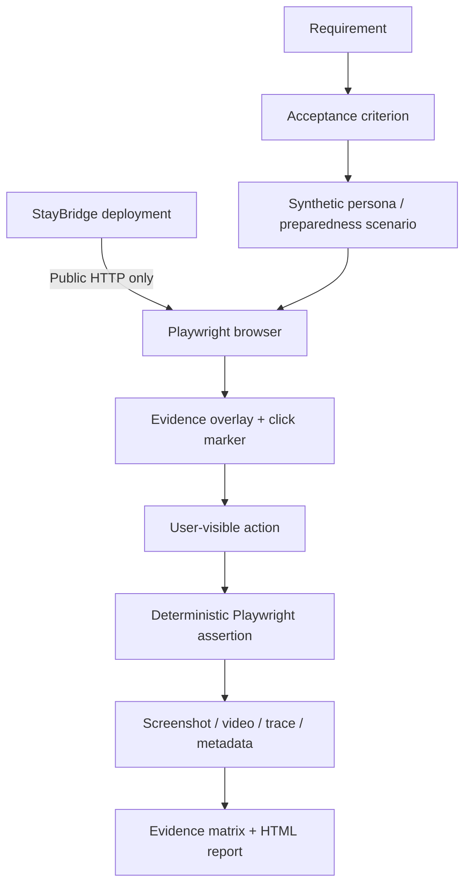
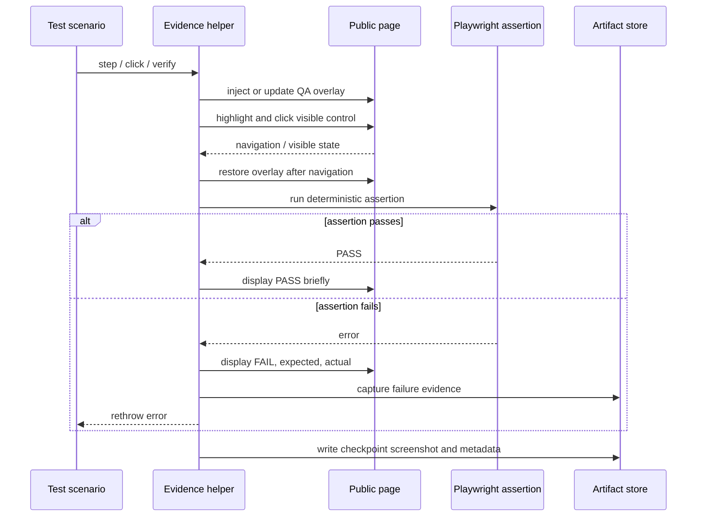

# Architecture

## Independent black-box boundary



The browser is the only test interface to StayBridge Tokyo. This repository never imports React components, rule-engine functions, internal fixtures, database access, internal state, or source-based assertions from the application repository.

## Execution modes

| Mode | Purpose | Overlay | Screenshot | Video | Trace |
| --- | --- | --- | --- | --- | --- |
| Functional | Fast regression feedback | Off/no-op | Failure | Retain on failure | Retain on failure |
| Evidence mobile | Persona review evidence at 390 × 844 | On | Named checkpoints and failure | On | On |
| Evidence admin | Preparedness evidence at 1440 × 900 | On | Named checkpoints and failure | On | On |

Each test receives an isolated browser context. No scenario may rely on storage or state left by another test. Personal scenarios use the user deployment (`BASE_URL`); crisis and municipality scenarios use the municipality deployment root (`MUNICIPALITY_URL`).

## Evidence synchronization

The evidence helper coordinates the browser display and the real assertion:



The overlay's `PASS` label is explanatory. Only the completed Playwright assertion establishes the result. The helper also logs the same step and AC IDs to the terminal.

## Overlay behavior

- A collision-resistant DOM ID is fixed at the top-left with maximum z-index and `pointer-events: none`.
- `QA EVIDENCE` distinguishes the injected layer from product UI.
- Step, total, acceptance IDs, action, verification, result, target hostname, and current path remain readable in video.
- A short-lived 500–800 ms marker identifies an important click; a temporary outline may identify its target.
- Initialization/navigation hooks reinject the overlay when the document is replaced.
- Human-readable pauses are centralized and enabled only in evidence projects; functional calls are no-ops.

## Artifact topology

```text
evidence/
├── screenshots/
│   ├── persona-a/
│   ├── crisis/
│   └── safety/
├── videos/
│   ├── persona-a/
│   └── crisis/
├── traces/
├── metadata/
└── reports/
```

Metadata binds an artifact to scenario, step, AC IDs, page target URL, configured user and municipality URLs, browser, viewport, result, timestamp, and `TARGET_COMMIT`. The run manifest exposes the configured URLs again as a `targetUrls` map. Large videos and traces are intended for CI artifacts; representative screenshots and Markdown may be versioned deliberately.

## Failure and reachability

Before scenarios begin, the suite checks both configured deployment roots. An unreachable target produces an actionable error identifying the URL and instructing the operator to start or deploy StayBridge. Assertion failure retains screenshot, video, trace, error text, and available metadata, then fails the test normally.
